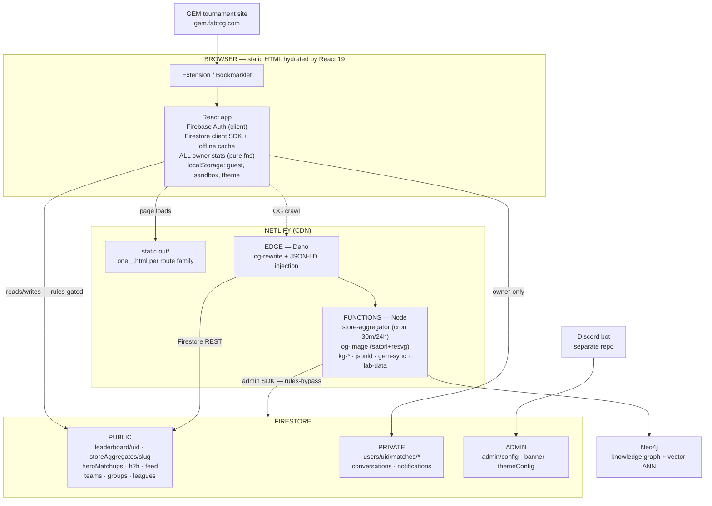
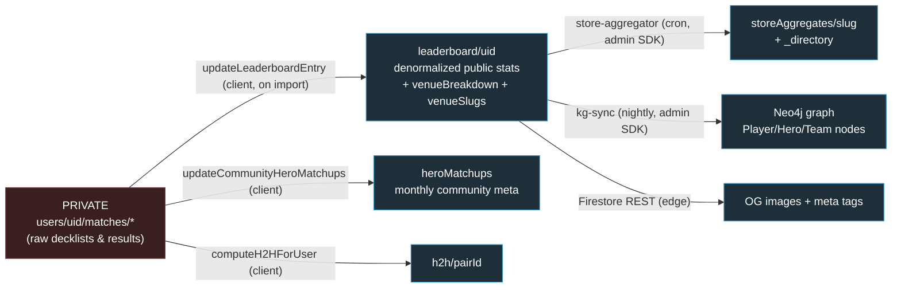
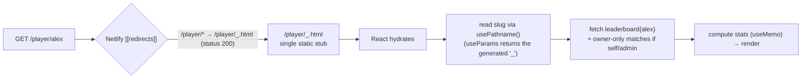
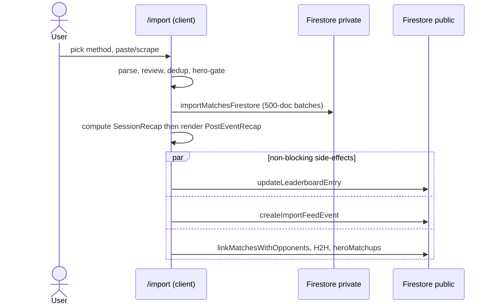
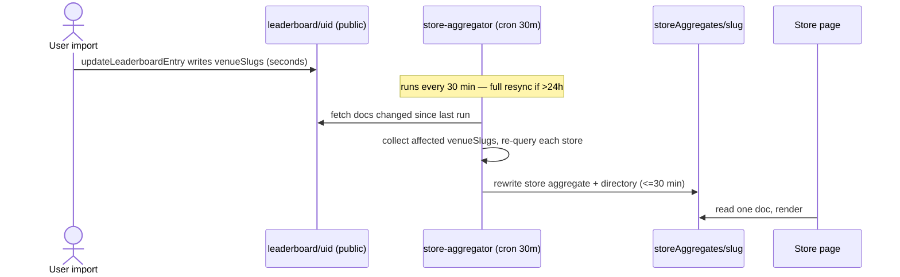
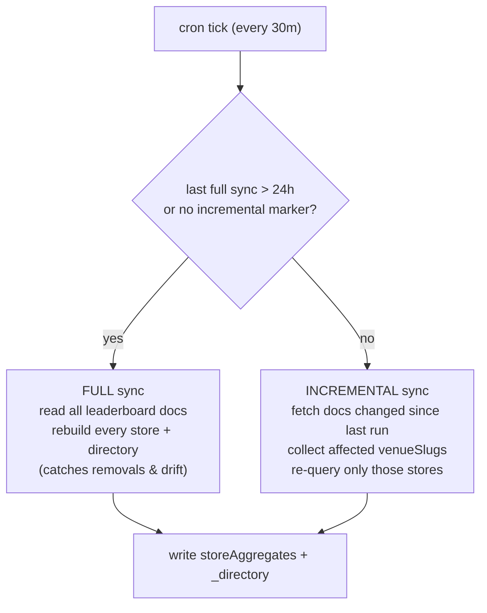
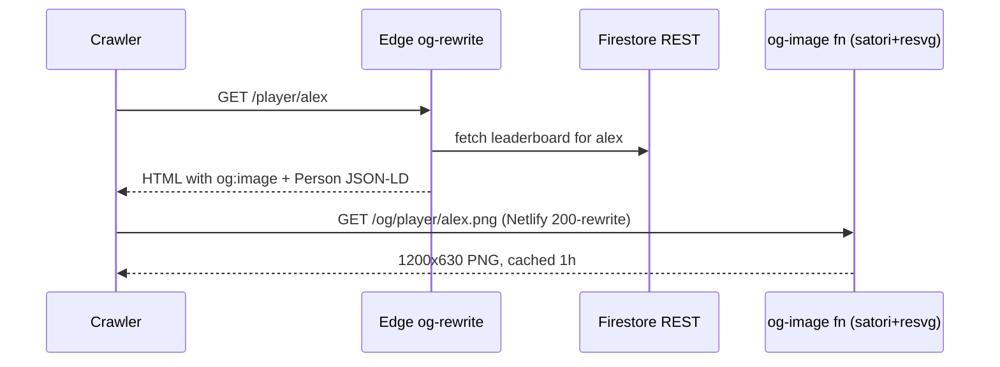
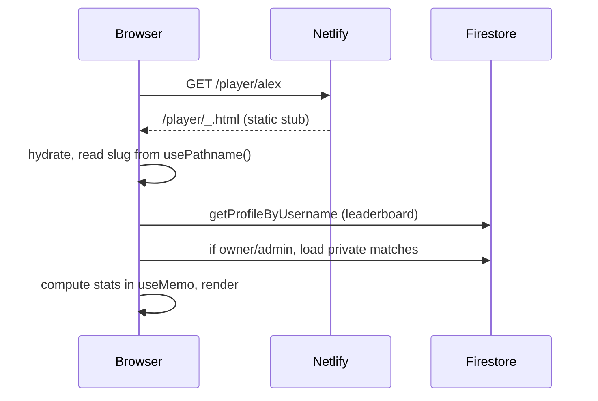

# FaB Stats — Architecture Diagrams

A one-page visual companion to [SYSTEM_DESIGN.md](SYSTEM_DESIGN.md). All diagrams render natively on
GitHub (Mermaid). For the narrative, tradeoffs, and feature inventory, read the full design doc.

---

## 1. System architecture

How the static front end, Firestore tiers, Netlify edge/functions, and the knowledge graph fit together.

---

## 2. The data-model spine: private matches → public projections

Raw matches stay private; every public surface is a derived, precomputed projection of them.

---

## 3. Static-export dynamic-route resolution

Why `/player/alex` works without a server: one static stub + Netlify rewrite + client-side slug read.

---

## 4. Import → stats → public projections

---

## 5. Store-page freshness (batch aggregation)

### Aggregator decision: full vs incremental

---

## 6. Social share / OG image

---

## 7. Player profile page load

