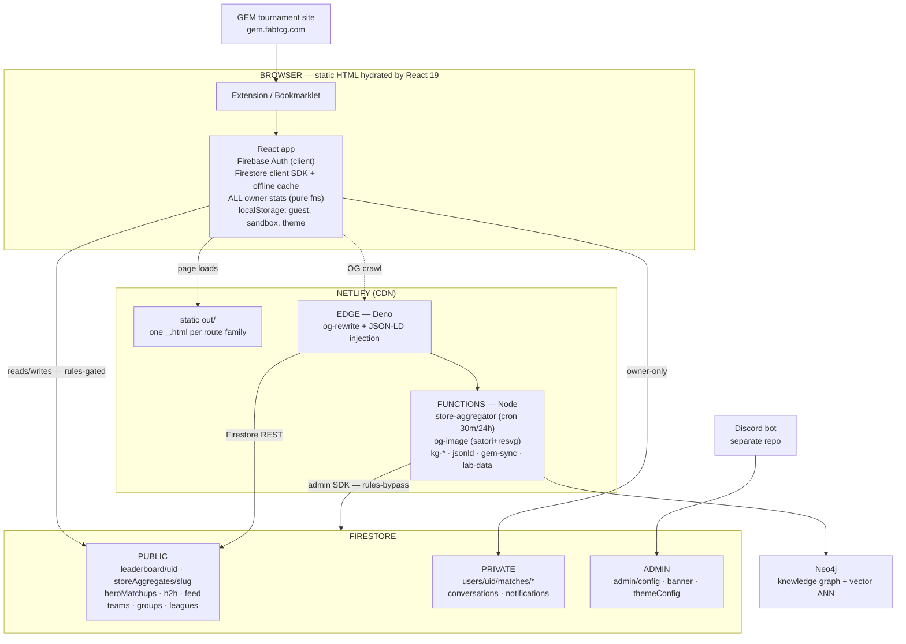
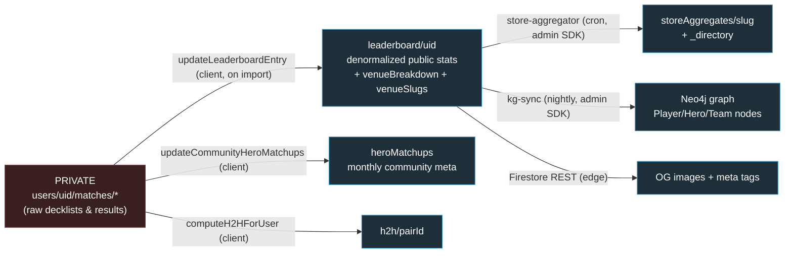
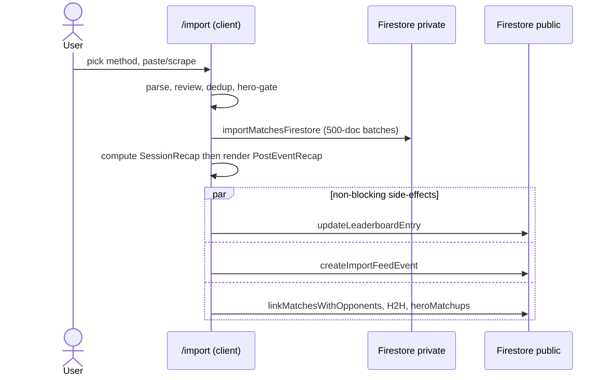
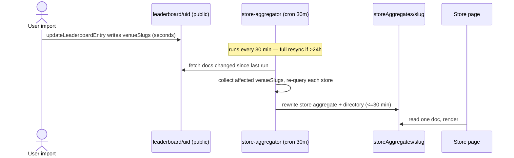
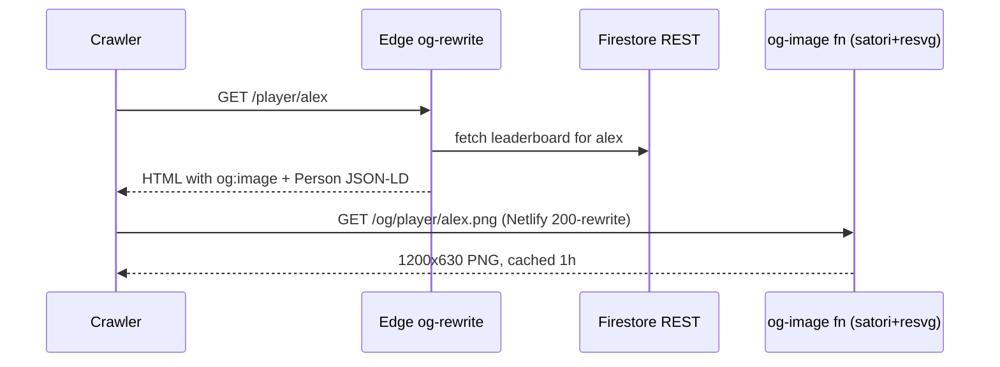
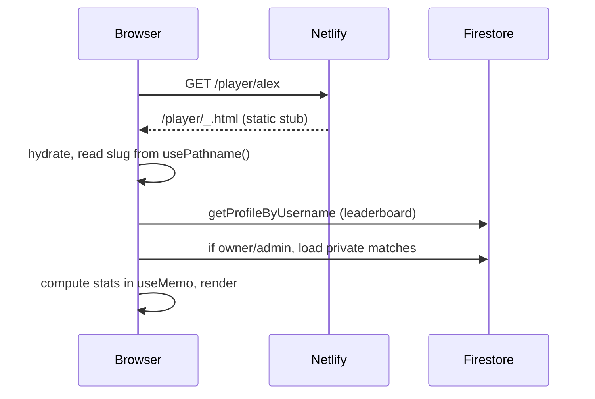

# FaB Stats — System Design

> A reference architecture document for **fabstats.net**, a competitive statistics tracker, social
> network, and daily-games platform for the *Flesh and Blood* TCG. Written as a system-design
> walkthrough: the big bet, the data model, every subsystem, the key request flows, the tradeoffs,
> and where it would break at scale.

---

## 1. TL;DR

FaB Stats lets players import their official tournament history (from GEM, the FAB tournament
system), then computes rich stats, achievements, leaderboards, head-to-heads, a community meta, and
social features (teams, groups, leagues, feed, DMs) on top of it. It also runs a suite of daily
puzzle games and a Neo4j-backed knowledge graph for semantic player discovery.

**The defining constraint:** it is a **100% static front end** (Next.js `output: 'export'`) on a CDN,
with **no application server**. Everything "dynamic" is achieved three ways:

1. **Client-side Firebase** (Auth + Firestore) for all per-user reads/writes.
2. **Scheduled / on-demand serverless functions** (Netlify Functions, Node) for anything a client
   *can't* do — chiefly aggregating across other users' private data.
3. **Edge functions** (Netlify Edge, Deno) for request-time HTML rewriting (OG/SEO).

That single bet — "no server, push logic to the client and to serverless at the edges" — explains
almost every other design decision in the system.

---

## 2. Tech Stack

| Layer | Choice |
|---|---|
| Framework | **Next.js 16** (App Router, `output: 'export'` static export), **React 19** |
| Language | **TypeScript 5** (strict) |
| Styling | **Tailwind CSS v4** (`@theme` CSS-variable tokens → runtime `data-theme` switching) |
| Auth | **Firebase Auth** (email/password, Google OAuth, guest mode) |
| Primary DB | **Firestore** (client SDK with `persistentLocalCache` + multi-tab manager) |
| Hosting / CDN | **Netlify** (static `out/`, redirects, cache + security headers) |
| Serverless | **Netlify Functions** (Node Lambda): store aggregator, OG image, KG, JSON-LD, lab data, GEM sync |
| Edge | **Netlify Edge Functions** (Deno): OG meta-tag rewriting |
| OG images | **satori** (JSX→SVG) + **@resvg/resvg-js** (SVG→PNG), WOFF fonts |
| Knowledge graph | **Neo4j** (property graph + vector ANN) + **MiniLM** 384-dim embeddings |
| Card data | **`@flesh-and-blood/cards`** npm package |
| Charts / UI | Recharts, lucide-react, Framer Motion, Radix UI, Sonner (toasts) |
| Companion | **Discord bot** (discord.js 14, separate repo `fab-stats-bot`) |
| Browser extension | MV3 content script (`extension/`), built + zipped into the main deploy |

---

## 3. High-Level Architecture



**Plain-text version of the same diagram:**

```
                         ┌────────────────────────────────────────────────────────┐
                         │                      BROWSER (client)                    │
                         │                                                          │
 GEM tournament site ───▶│  Extension / Bookmarklet ──▶ /import                     │
 (gem.fabtcg.com)        │  React 19 app (static HTML hydrated)                     │
                         │   • Firebase Auth (client)                               │
                         │   • Firestore client SDK (persistentLocalCache)          │
                         │   • ALL stats computed here (pure fns over MatchRecord[])│
                         │   • localStorage: guest store, sandbox, theme, caches    │
                         └───────┬───────────────────────────────┬──────────────────┘
                                 │ reads/writes (rules-gated)     │ static assets, OG crawls
                                 ▼                                ▼
        ┌────────────────────────────────────┐     ┌───────────────────────────────────────┐
        │             FIRESTORE              │     │            NETLIFY (CDN)              │
        │  PUBLIC:  leaderboard/{uid}        │     │  • static out/ (one _.html per route) │
        │           storeAggregates/{slug}   │     │  • [[redirects]] /player/* → _.html   │
        │           heroMatchups, h2h, feed  │     │  • cache + CSP/security headers       │
        │           teams, groups, leagues   │     │                                       │
        │  PRIVATE: users/{uid}/matches/*    │     │  ┌─────────── EDGE (Deno) ──────────┐ │
        │           users/{uid}/notifications│     │  │ og-rewrite{,-store,-entity,-meta}│ │
        │  ADMIN:   admin/config, banner...  │◀────┼──┤ inject OG/Twitter meta + JSON-LD │ │
        └───────────────┬────────────────────┘     │  └──────────────────────────────────┘ │
                        │ admin SDK (rules-bypass)  │  ┌──────── FUNCTIONS (Node) ────────┐ │
                        │                           │  │ store-aggregator (cron 30m/24h)  │ │
                        ▼                           │  │ og-image (satori+resvg)          │ │
        ┌────────────────────────────────────┐     │  │ jsonld, kg-search/graph/stats    │ │
        │   SERVERLESS AGGREGATION / KG      │────▶│  │ kg-sync (nightly), gem-sync      │ │
        │   reads ALL matches, writes        │     │  │ lab-data, firebase-admin         │ │
        │   precomputed public docs          │     │  └──────────────────────────────────┘ │
        └───────────────┬────────────────────┘     └───────────────────────────────────────┘
                        ▼
                 ┌────────────┐         ┌────────────────────┐
                 │   Neo4j    │         │  Discord bot (sep. │
                 │ (KG + ANN) │         │  repo, writes      │
                 └────────────┘         │  analytics to FS)  │
                                        └────────────────────┘
```

---

## 4. The Central Bet: static export + client Firebase + serverless edges

**Decision:** No application server. Next.js compiles to static HTML; the client talks directly to
Firebase; serverless/edge functions fill the gaps.

**Why it works here:**
- **Cost & ops:** a CDN serving static files + Firestore's pay-per-use model is near-zero fixed cost
  and scales automatically. No servers to patch, no autoscaling to tune.
- **Per-user data is naturally client-shaped:** a logged-in user reads their *own* matches and
  computes their *own* stats. Firestore security rules enforce ownership; no backend needed to
  mediate.
- **Latency:** static HTML is instant from the edge; data streams in after hydration.

**What it costs (and how each cost is paid back elsewhere):**

| Cost of "no server" | Mitigation |
|---|---|
| No SSR → dynamic routes can't be pre-rendered per entity | `generateStaticParams` emits one `_.html` stub per route; client reads the real slug from `usePathname()`; Netlify redirects `/player/*` → `/player/_.html` |
| No server → can't put per-entity data in HTML for crawlers | **Edge functions** rewrite OG/Twitter meta + JSON-LD at request time |
| Firebase API keys ship in client JS | Firestore **security rules** are the real boundary; keys are domain-restricted but assumed public |
| Clients can't read *other* users' private matches | **Serverless aggregators** (admin SDK) precompute public rollups (leaderboard, stores, meta, H2H) |
| No backend to rate-limit / validate writes | Rules do field validation; some abuse vectors are accepted (see §11) |

This is the thread that ties the whole system together: **anything a single client can compute about
itself is done client-side; anything that requires crossing the public/private boundary is precomputed
server-side and published as a public document.**

---

## 5. Data Model

Firestore documents fall into three visibility tiers, enforced by `firestore.rules`:

### Public (world-readable)
- **`leaderboard/{uid}`** — the denormalized per-user stats doc: totals, win rate, hero breakdown
  (by format/event type), weekly/monthly windows, nemesis, streaks, **`venueBreakdown`** (top 50
  venues) and **`venueSlugs`** (array index). This is the workhorse public doc — it powers rankings,
  OG images, store aggregation, and the KG, all without touching private data.
- **`storeAggregates/{slug}`** + `_directory` — precomputed store pages (written only by the
  aggregator via admin SDK).
- **`heroMatchups/{docId}`** — community hero-vs-hero tallies, **bucketed by month** to bound doc
  growth; split by format / event type / rated.
- **`h2h/{pairId}`** — precomputed head-to-head between two FaB Stats users (`pairId` = sorted UIDs).
- **`feedEvents/{id}`** — public activity stream (imports, achievements, placements, game results).
- **`teams/`, `groups/`, `leagues/`** (+ `teamnames/`, `groupnames/`, `leaguenames/` slug indexes,
  + `members` subcollections).
- **`matchThreads/{fingerprint}`** — shared match comment threads keyed by a deterministic
  cross-player fingerprint.
- Per-game results + public stats (`fabdoku-results`, `crosswordPlayerStats`, …).

### Private (owner-only)
- **`users/{uid}/matches/{matchId}`** — the raw match records. *The crown jewels* — kept private so
  strategy/meta knowledge isn't leaked.
- **`users/{uid}/notifications`, `/groups`, per-game `-stats`** etc.
- **`conversations/{id}` + `/messages`** — gated by a `participants` array; deterministic `id` =
  sorted UIDs.

### Admin
- **`admin/config`** (the admin email list — the root of trust), `admin/banner`, `admin/themeConfig`,
  `admin/badges`, `admin/mutedWallUsers`, `admin/discord-bot/*`.

**Key insight:** the public/private split is the spine of the whole system. Raw matches are private;
every public surface (rank, store, meta, H2H, KG, OG image) is a **derived, precomputed projection**
of those matches that deliberately exposes only aggregate or opted-in (`isPublic`) data.



`MatchRecord` core fields: `date`, `heroPlayed`, `opponentHero`, `opponentName`, `opponentGemId`,
`result`, `format`, `venue`, `eventType` / `eventTypeOverride`, `notes` (`"Event Name | Round 5"`),
`day2?`, `rated?`, `editedAt?`, `commentCount?`, `source` (extension/bookmarklet/paste/csv/manual).

---

## 6. Subsystems

### 6.1 Frontend & Routing
- **Static export with client data.** Every page pre-renders to HTML; data streams in via hooks
  (`useMatches`, `useLeaderboard`, `useFeed`, `useTeam`, …).
- **Dynamic-route trick:** `generateStaticParams()` returns a single `{ slug: '_' }`, emitting one
  `_.html` per route family. Netlify `[[redirects]]` (status 200, not 301) map `/player/*`,
  `/teams/*`, `/group/*`, `/leagues/*`, `/stores/*`, `/inbox/*` to their `_.html` stubs. The
  component then reads the **real** slug from `usePathname()` (because `useParams()` returns the
  generated `"_"`). This is the single most important — and most error-prone — frontend pattern.
- **State:** React + module-level caches in hooks (e.g. `useMatches` caches per-uid across
  mount/unmount); real-time `onSnapshot` listeners for messages/notifications.
- **Theming:** Tailwind v4 `@theme` compiles utilities to `var(--color-…)`, so switching
  `<html data-theme>` re-skins the app with no CSS rebuild. An inline `<head>` script applies the
  saved theme before paint to avoid a flash.

### 6.2 Auth & Storage
- **Firebase Auth** with three modes: email/password, Google OAuth, and **guest mode**
  (localStorage-only). On sign-in, guest matches auto-migrate to Firestore.
- **`isAdmin`** is a client check against `admin/config` (cached 10 min). Admin emails are treated as
  non-secret; the real enforcement is in rules + the admin SDK boundary.
- **Storage layers:** Firestore (with offline persistent cache) for users; `localStorage` for guests
  (`storage.ts`), the **admin sandbox** (`sandbox-store.ts`), theme, and various SWR caches.
- **Dedup fingerprint** (`date | opponentName.lower | normalizeNotes(notes) | result`) is shared by
  the Firestore import path and the sandbox so testing matches production behavior. `normalizeNotes`
  canonicalizes playoff labels (`Top 8`/`Playoff` → `P1`, `Finals` → `P3`).

### 6.3 Import Pipeline
Five methods converge on `importMatchesFirestore()` (fingerprint dedup → 500-doc batches):
1. **Browser extension** — DOM-scrapes GEM, auto-detects heroes, LZ-compresses, opens `/import#ext=`.
2. **Quick-Sync bookmarklet** — mobile one-tap, `#quickext=`, silent dedup, recap of only-new.
3. **Copy-paste** — 20+ regex heuristics (`gem-paste-import.ts`); fragile but works anywhere.
4. **CSV** — structured GEM export; most reliable.
5. **Admin auto-sync** — serverless `gem-sync` with stored encrypted credentials.

After the write, a chain of **non-blocking** side-effects fires: `createImportFeedEvent`,
`updateLeaderboardEntry`, `linkMatchesWithOpponents` (cross-player hero exchange), `computeH2HForUser`,
`updateCommunityHeroMatchups`, achievement detection. The **post-import recap** (`session-recap.ts` +
`PostEventRecap.tsx`) shows record, hero insights (mastery tier-ups, win-rate deltas), new opponents,
session matchups with community context, day-2 celebration, and a "fill missing heroes" nudge.
Special handling: **hero-required gate** (hard block for events ≥ 2026-02-24 missing a hero),
**day-2 detection** (>10 swiss rounds), **per-format/round segment editor**, and an **admin sandbox**
that routes the entire flow to isolated localStorage with all Firestore side-effects skipped.

### 6.4 Stats Computation
All of it is **pure functions over `MatchRecord[]`**, run client-side in `useMemo` — no server compute,
no cached aggregates for the *owner's* view. `stats.ts` derives overall/hero/opponent/event/venue
stats, playoff finishes, streaks, tournament analytics (start patterns, bounce-back, rolling 10-event
win rate, submarine runs), day-2 boundaries, and event-type classification
(`override → refineEventType → guessFromNotes`, lowest-prestige wins, qualifiers → "Other").
Achievements (200+) are pure checks; only earned IDs are persisted, and `detectNewAchievements`
diffs before/after. Mastery tiers and badge tiers are count-based.

### 6.5 Aggregation & Serverless (the public projections)
This is where the public/private boundary is crossed, server-side:
- **`updateLeaderboardEntry`** (client, on import) writes the per-user public stats doc incl.
  `venueBreakdown` + `venueSlugs`.
- **`store-aggregator.mts`** (cron **every 30 min**; **full** resync if >24h since last full, else
  **incremental**): reads leaderboard docs via admin SDK, rolls up per-venue player/hero/format stats
  into `storeAggregates/{slug}`. Incremental finds changed docs since the last run, collects affected
  `venueSlugs`, and re-queries only those stores (`array-contains`). Private players count toward
  totals but are **not named** (`isPublic` filter). Full sync corrects drift (e.g. a player who *left*
  a store — incremental can't see removals). See §9.2 for the full flow.
- **`hero-matchups.ts`** — incremental community meta, month-bucketed, mirror-deduped by
  `opponentGemId` + lexicographic UID order.
- **`h2h.ts`** — precomputed pairwise records for instant `/compare`.
- **Knowledge graph** — nightly `kg-sync` ingests public leaderboard + matchups + articles into
  **Neo4j** (Player/Hero/Team nodes, `MATCHUP_WITH` edges). `kg-search` embeds free-text queries with
  a ~90 MB MiniLM model and runs vector ANN (optionally graph-filtered). `kg-graph`/`kg-stats`/
  `jsonld`/`lab-data` expose graph data, schema.org JSON-LD, and the `/lab` admin console.

### 6.6 OG Images & SEO
The static-export consequence: there's no per-entity HTML, so social previews are built at the edge.
- **Edge functions** (`og-rewrite{,-store,-entity,-meta}.ts`, Deno) intercept the HTML for
  `/player/*`, `/stores/*`, `/leagues|teams|group/*`, `/meta`, fetch data via **Firestore REST**
  (public API key, rules-gated), and rewrite `og:*`/`twitter:*`/canonical + inject Person/Org JSON-LD.
- **`og-image.mts`** (Node Lambda) renders a 1200×630 PNG with **satori + resvg-js** from WOFF fonts,
  reachable via clean `/og/<kind>/<slug>.png` URLs (Netlify 200-rewrites to the function for CDN
  cache-keying). Cache: 1h CDN, 1d stale-while-revalidate.
- All URLs are forced to the `www.fabstats.net` canonical (bare domain 301s; crawlers won't follow a
  301 for an image).

### 6.7 Social & Community
Teams, groups (with user-scoped membership docs for fast enumeration), leagues (scoring rules +
on-demand standings), friendships and DMs (**deterministic sorted-UID IDs** to avoid duplicate docs),
a global activity **feed** (visibility-filtered, deduped by user+type+date), **match comment threads**
(fingerprint-keyed across both players), polls, **featured profiles** (22 "reason" pools shuffled per
load), unified **SmartSearch** (players + teams + stores), the **store directory** (3-tier
memory→localStorage(SWR)→cold-aggregation cache), and a **mute/block** layer that filters spam from
every public surface.

### 6.8 Daily Games
FaBdoku (hero + card modes), Crossword, and companions. Each game is **fully isolated**: own Firestore
collections, own `localStorage` prefix, own feed event type, own seed. Determinism comes from
**UTC-date seeds** (`getTodayDateStr()` → `dateToSeed` → mulberry32). FaBdoku hero mode is locked to a
legacy **Java-style hash** (changing it breaks every historical puzzle + uniqueness score); newer
games use Fibonacci hashing. Card mode = hero seed **+ 1,000,003**. Per-cell **uniqueness scoring**
aggregates community picks; streaks guard against double-counting via `lastPlayedDate`.

### 6.9 Admin, Ops & Infra
A tabbed admin dashboard (users, feedback triage, analytics, backfills, banners, seasons, themes,
badges, mute, **import sandbox**, Discord bot analytics, event-type overrides). **Backfill jobs**
(`admin.ts`) batch-recompute leaderboard/day2/GEM-IDs/match-linking/H2H/hero-matchups in 25-user
chunks. Analytics are **counter docs with hourly/daily buckets** (to dodge Firestore's ~1 write/sec/doc
hot-spot limit). Deploy = `npm run build` (browser-extension zip **+** Next static export) → Netlify
`out/`. `netlify.toml` carries redirects, immutable-vs-revalidate cache headers, and a strict-ish CSP
(must allow `unsafe-inline` for Firebase auth).

---

## 7. Caching & Consistency Model

The system is **eventually consistent** by design, with caching at many layers:

| Layer | Mechanism | Staleness |
|---|---|---|
| CDN HTML | `max-age=0, must-revalidate` | always fresh |
| CDN static JS/CSS | hashed, `immutable, 1y` | never (content-addressed) |
| OG images | CDN `s-maxage=1h` + `swr=1d` | ≤ 1h |
| Firestore client | `persistentLocalCache` | until revalidation |
| Store directory | memory + localStorage SWR, 15-min TTL | ≤ 15 min |
| Leaderboard doc | recomputed on import (not live) | until next import/backfill |
| Store aggregates | cron 30 min / full 24h | ≤ 30 min (≤ 24h for removals) |
| Community meta / H2H | on import + backfill | minutes–hours |
| Knowledge graph | nightly sync | ≤ 24h |
| Admin status | in-memory, 10-min TTL | ≤ 10 min |

The deliberate stance: **freshness is traded for simplicity and cost** everywhere it's user-acceptable.
A new player showing up on a store page ≤ 30 min later is fine; paying for immediate cross-user
consistency is not worth the complexity (see the store-aggregation discussion in §9.2).

---

## 8. Security & Privacy Model

- **Firestore rules are the only real boundary** (no server to mediate). Public docs are world- or
  auth-readable; private match data is owner-only; `admin/*` writes require the admin email list.
- **Public/private split** keeps raw decklists/matches private while still powering rich public
  features via aggregates.
- **`isPublic` / `hideFromGuests` / `hideFromFeed` / `hideFromSpotlight`** give users graduated
  visibility control; aggregators and the KG honor them.
- **Accepted risks** (no backend to prevent them): client could spam community counters
  (`heroMatchups`, `kudos`, `commentCount`) — mitigated by throttles + field validation, not hard
  auth; Firebase keys are public (rules-gated); admin emails are discoverable by any authed user.
- **CSP / security headers** in `netlify.toml` (X-Frame-Options DENY, HSTS, Referrer-Policy, etc.);
  CSP must permit `unsafe-inline` script for the Firebase auth flow.

---

## 9. Key Request Flows

### 9.1 Import → stats → public projections



```
User → /import (pick method) → parse (extension/paste/CSV) → review UI
  → applyImportOverrides (hero/format/day2/turn-order)
  → hero-gate check → importMatchesFirestore (dedup, 500-batches)   [PRIVATE write]
  → compute SessionRecap (before/after) → PostEventRecap
  → fire-and-forget:  feedEvent | updateLeaderboardEntry            [PUBLIC write]
                      linkMatchesWithOpponents | computeH2H
                      updateCommunityHeroMatchups | achievements
```

### 9.2 Store page freshness (a worked example of the whole pattern)



```
t0  import → updateLeaderboardEntry writes leaderboard/{uid}
            with venueBreakdown + venueSlugs (incl. the store)      [seconds]
t1  store-aggregator cron (≤30m): incremental sync
      → find leaderboard docs changed since last run
      → collect affected venueSlugs → re-query each store's players
      → rewrite storeAggregates/{slug} + _directory                [≤30 min]
t2  store page reads storeAggregates/{slug}                        [immediate]
```
Why batched, not immediate? (1) **Architectural necessity** — the client can't read other players'
private matches, so the page *must* read a precomputed public doc built by something with admin
access. (2) **Read amplification** — rebuilding a store re-reads every player at it; doing that
synchronously on every import (×N stores, ×many concurrent importers) is wasteful; the cron
**coalesces**. (3) **Self-healing** — the nightly full sync fixes drift incremental can't see (e.g.
a player who *left* a store). An on-demand trigger (`?mode=incremental`) exists for instant refresh.

### 9.3 Social share / OG image



```
Crawler GETs /player/alex
  → Edge og-rewrite intercepts HTML
  → Firestore REST fetch leaderboard{username:alex} (public)
  → inject og:title/description/image + Person JSON-LD
  → crawler reads og:image = www.fabstats.net/og/player/alex.png
  → Netlify 200-rewrite → og-image function → satori→SVG→resvg→PNG
  → cached at CDN (1h)
```

### 9.4 Player profile page load



```
/player/alex → Netlify rewrite → /player/_.html (static)
  → React hydrates, reads slug from usePathname()
  → getProfileByUsername (leaderboard) → if owner/admin: load private matches
  → compute*Stats (client, useMemo) → render
```

---

## 10. The Big Tradeoffs (interview meat)

| Decision | Why | What it costs |
|---|---|---|
| **Static export, no server** | Cheap, auto-scaling, zero ops | No SSR; `_.html` stub trick; OG at edge; keys client-side |
| **Client-side Firebase + rules** | No auth backend; per-user data is client-shaped | Keys public; no central rate-limit/validation; abuse vectors accepted |
| **Public/private doc split** | Protect raw matches; still enable public features | Must maintain *derived* public docs in sync with private source |
| **Precomputed aggregates (store/meta/H2H)** | Clients can't read others' private data; read scales with #stores not #matches | Backend complexity; staleness; consistency upkeep |
| **Batch cron aggregation (30m/24h)** | Coalesces redundant rebuilds; cheap | ≤30 min latency; removals only caught by full sync |
| **Stats computed client-side (pure fns)** | Real-time UI on edit; no compute layer; matches are small (<1k) | Slow on huge histories; can't query "top players" without iteration → hence leaderboard doc |
| **Leaderboard = single denormalized doc** | One read per player to rank | Must re-sync on every change; stale until import/backfill |
| **Edge OG rewrite** | Per-entity previews without per-entity HTML | Firestore call per crawl; Deno can't import `src/` → duplicated helpers (drift risk) |
| **satori+resvg over headless Chrome** | <1 MB vs 500 MB; sub-second; cheap | Layout quirks; explicit sizes; WOFF-only fonts |
| **Guest mode (localStorage) + migrate** | Zero-friction trial | Data lost if storage cleared; no cross-device |
| **Per-game isolated collections** | Independent evolution; safe deletion | Schema duplication per game; no cross-game aggregation |
| **UTC-only game seeds** | Same puzzle worldwide; deterministic | Easy to break with local-time date calls (lint-enforced) |
| **Frozen FaBdoku hash** | Preserves all historical puzzles | Two hash impls forever; legacy debt |
| **Deterministic IDs (friendships/convos/H2H/threads)** | Idempotent, dedup without a server | 3rd participant needs new scheme; UID exposure |
| **Analytics as bucketed counters** | Avoids Firestore hot-doc write limit | Can't slice by user/precise time |
| **Admin status cached 10 min** | Avoids per-request read | New admins wait ≤10 min |

---

## 11. Where It Breaks at Scale (and what I'd change)

The current design is excellent for its actual scale (thousands of users, <1k matches each). The
fault lines if it grew 100×:

1. **Client-side stats on huge histories.** A player with 10k+ matches recomputes everything in
   `useMemo` on the main thread. *Fix:* web worker, or precompute a per-user stats cache server-side.
2. **`importMatchesFirestore` reads *all* existing matches** to build the dedup set on every import.
   *Fix:* maintain a fingerprint index doc, or query by date range.
3. **No central rate-limiting / write validation.** Community counters (`heroMatchups`, `kudos`,
   `commentCount`) are client-writable. *Fix:* move these writes behind a serverless function /
   callable with server-side validation and quotas.
4. **Leaderboard re-sync is O(all users)** in 25-user batches with no checkpointing — hours at scale,
   restart-from-zero on crash. *Fix:* incremental/cursored backfill, or event-driven recompute.
5. **Store aggregation coalesced at 30 min** but full sync re-reads the entire leaderboard. *Fix:*
   for freshness, **trigger a scoped incremental sync on import** (debounced) — re-reads only that
   user's 1–3 stores; keep the cron as a safety net. (Discussed with the team; deferred because ≤30
   min is acceptable UX.)
6. **Edge/Lambda ↔ `src/` duplication** (Deno can't import the app tree). *Fix:* a shared package
   compiled for both runtimes, or codegen, to kill drift between `og-rewrite*` and `og-image`.
7. **KG nightly sync** → 24h lag for new players / privacy changes. *Fix:* incremental KG upserts on
   import for opted-in public players.
8. **OG cold-start** (satori + ~font load) can exceed crawler timeouts on first share. *Fix:* warm
   pool / pre-render on profile creation / smaller card.
9. **Single canonical-domain + `unsafe-inline` CSP** — acceptable, but tightening CSP needs a Firebase
   SDK that doesn't require inline scripts.

---

## 12. Complete Feature Inventory

**Match tracking & import**
- 5 import methods (extension, bookmarklet, copy-paste, CSV, admin auto-sync) with fingerprint dedup
- Guided review: per-event hero, per-round hero/format segment editor, turn-order, notes
- Day-2 detection + per-format record split; hero-required gate (post-2026-02-24)
- Opponent-hero pre-fill (read opponents' linked matches) + post-import cross-player linking
- Coverage-data enrichment (fabtcg.com top-8 decklists)
- Post-import recap (record, hero insights, mastery tier-ups, new opponents, community matchup context)
- Quick-Sync (mobile, silent dedup, per-event remove) + admin import **sandbox** (isolated, routable)

**Stats & profile**
- Overall / hero / opponent / matchup / event / venue stats; format splitting
- Playoff finish classification, trophy case, best finish
- Tournament analytics (start patterns, bounce-back, rolling win rate, submarine runs, after-bye, etc.)
- 200+ achievements, hero mastery tiers, profile/event/admin badges, kudos
- Profile customization (themes, backgrounds, card borders, underlines, emblems, showcase)
- Public/private visibility controls; "On This Day"; share cards

**Community & social**
- Public leaderboard with ranks/tiers; community **meta** + matchup matrix
- Teams, groups, leagues (scoring + standings), friends, DMs, notifications inbox
- Activity feed (imports, achievements, placements, game results) + reactions + comments
- Match comment threads (cross-player), polls/predictions, featured profiles, discover
- Global search (players/teams/stores), **store directory** + per-store pages, head-to-head `/compare`
- Mute/block moderation across all public surfaces

**Daily games**
- FaBdoku (hero + card), Crossword, and companion games; streaks, uniqueness scoring, shareable results

**Discovery / SEO / integrations**
- Per-entity OG images (player/store/league/team/group/meta) + edge meta rewriting
- JSON-LD structured data; sitemap/robots; www canonicalization
- Neo4j knowledge graph: semantic player search, similarity, graph viz, `/lab` console
- Discord companion bot (commands + analytics)

**Admin & ops**
- Dashboard (users, feedback triage, analytics, growth)
- Backfills (leaderboard, day2, GEM IDs, match linking, H2H, hero matchups, date fixes)
- Event-type overrides, banners, seasons, theme config, badge/mute management, broadcast
- Import sandbox; KG / SEO-health / content-performance consoles

---

*Generated from a full-codebase architecture sweep. For the canonical details of any subsystem, the
authoritative source is the code itself — this document is the map, not the territory.*
